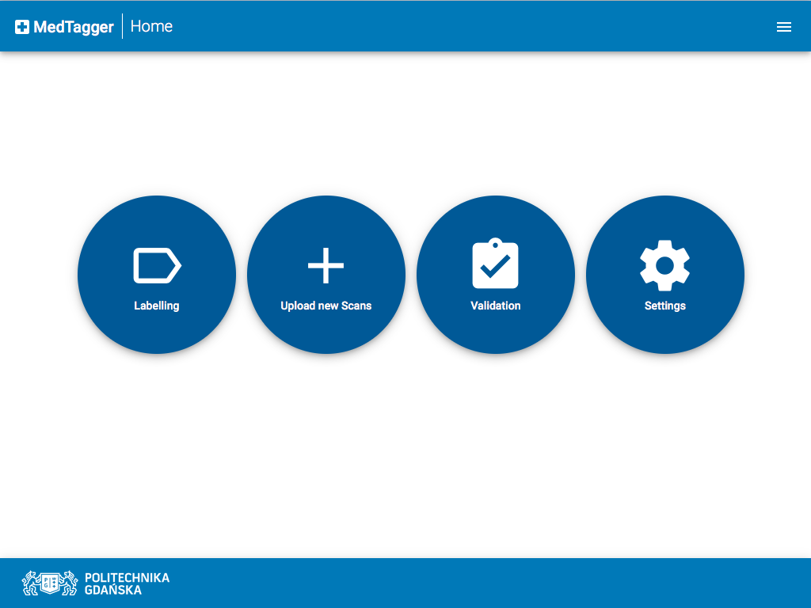
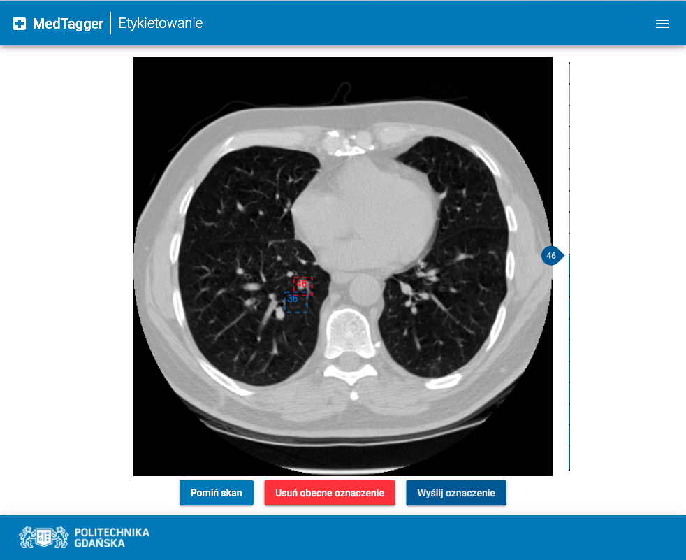

# MedTagger

**MedTagger** is a collaborative framework for annotating **medical datasets**.

Main goal of this project was to design and develop software environment,
which helps in **aggregation and labeling** huge datasets of medical scans,
powered by idea of **crowdsourcing**. Platform also provides mechanism for
label **validation**, thus making produced datasets of labels more reliable
for the future use.

## What is currently done?
 - [x] User Interface with dynamic 3D scans manipulation
 - [x] Backend architecture ready to be scaled up
 - [x] Basic labeling mechanism ready to be extended with new features
 - [x] Basic validation mechanism
 - [x] Basic users management system
 - [x] Dockerized and virtualized (with Vagrant) environment   

## What needs to be done?
 - [ ] New CI flow after migration from GitLab to GitHub
 - [ ] Internationalization of the whole platform
 - [ ] Extended labeling mechanism using magic lasso
 - [ ] Extended labeling mechanism using additional views for 3D scans
 - [ ] Extended validation mechanism with looking for similar labels
 - [ ] Generating Machine Learning datasets on demand

## Development
This is the monorepo for the whole platform. More information about the
development process can be found in each of the projects itself. In case
of questions don't hesitate to contact with authors.

MedTagger consists of two main parts:
 - `frontend` - User Interface application written in Angular 4,
 - `backend` - backend system's architecture written in Python.

## User Interface
Below screenshots shows how MedTagger looks like.

#### Main Page

#### Labeling Page

#### Validation Page

#### Upload Page

