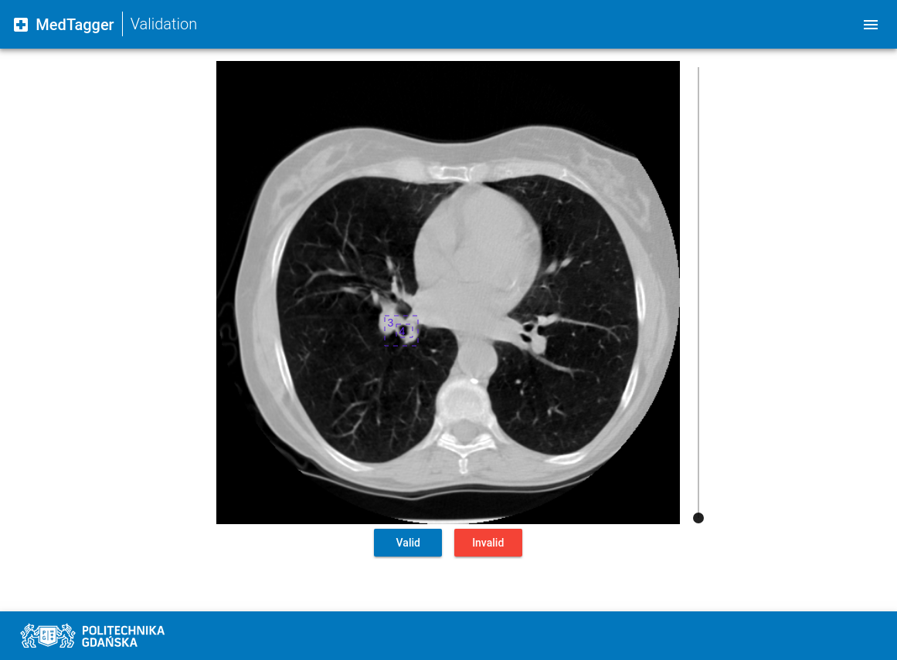
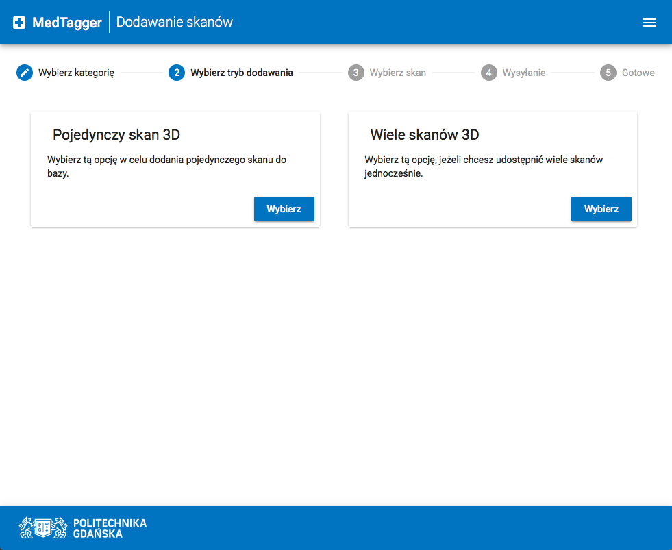

# MedTagger

**MedTagger** is a collaborative framework for annotating **medical datasets**.

Main goal of this project was to design and develop software environment,
which helps in **aggregation and labeling** huge datasets of medical scans,
powered by idea of **crowdsourcing**. Platform also provides mechanism for
label **validation**, thus making produced datasets of labels more reliable
for the future use.

MedTagger is still **under heavy development**, so please keep in mind that
many things may change or new versions may not be fully backward compatible.
Contact with us directly in case you want to use our work :)

[](https://travis-ci.org/jpowie01/MedTagger)

## What is currently done?

 - [x] User Interface with dynamic 3D scans manipulation
 - [x] Backend architecture ready to be scaled up
 - [x] Basic labeling mechanism ready to be extended with new features
 - [x] Basic validation mechanism
 - [x] Basic users management system
 - [x] Dockerized and virtualized environment (with Vagrant)

## What needs to be done?

 - [ ] Extended labeling mechanism using magic lasso
   - [ ] Frontend
   - [x] Backend
 - [ ] Extended labeling mechanism using additional views for 3D scans
   - [ ] Frontend
   - [x] Backend
 - [ ] Extended validation mechanism for faster verification of similar labels
   - [ ] Frontend
   - [ ] Backend
 - [ ] Generating Machine Learning datasets on demand
   - [ ] Frontend
   - [ ] Backend

## Setup

To set up MedTagger locally you can use Docker-Compose:

```bash
$ docker-compose up
```

Default development account is:
 - email: `admin@medtagger.com`,
 - password: `medtagger1`.

Keep in mind that this is not the best way for development as code changes
require rebuilding Docker containers. In case you want to develop MedTagger,
please check [Development](#development) section below.

### Production use

You can also specify where MedTagger UI should look for API and how should it
be built by specifying environment variables:

```bash
$ docker-compose up
```

For now, please **disable default admin account**. This will be disabled automatically
on production builds in the future!

**Keep in mind that this project is not fully stable yet!**

## Development

More information about the development process can be found in each of the
projects itself. In case of questions don't hesitate to contact with authors.

MedTagger consists of two main parts:
 - `frontend` - User Interface application written in TypeScript & Angular ([more](/frontend)),
 - `backend` - system's architecture and API written in Python ([more](/backend)).

You can develop whole platform natively or using Vagrant virtual machine.
 More information can be found in our [docs](/docs).

## User Interface

Below screenshots show how MedTagger looks like:

#### Main Page


#### Labeling Page


#### Validation Page


#### Upload Page

